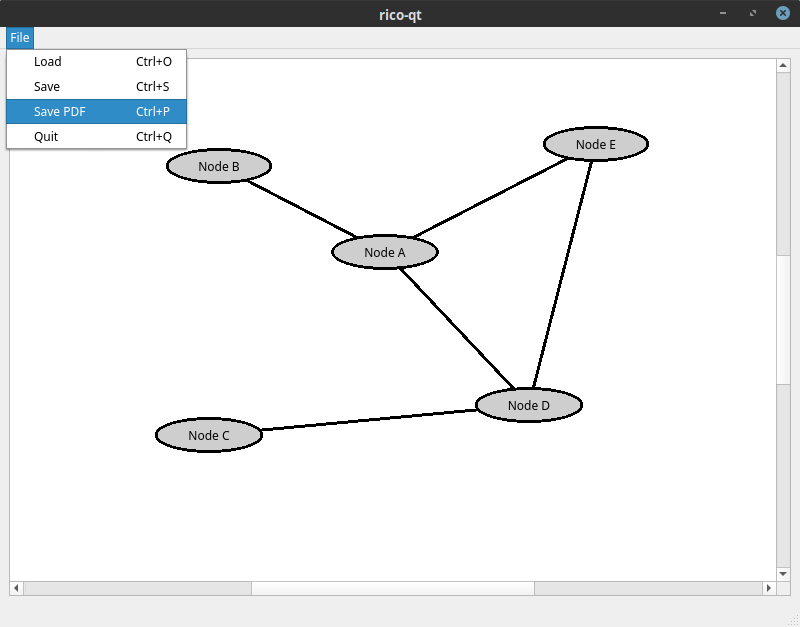

# rico-qt

rico-qt is a QT based applications that allows simple and fast creation of rico clusters. It uses a simple (example: [rico-qt-save.json](resources/rico-qt-save.json) ) JSON representation to store documents. It also generates small efficient PDF output (example: [rico-qt-print.pdf](resources/rico-qt-print.pdf) ) you can easily use to print, present and postprocess.

## Screenshots

## Installation

Either compile it using the QT open source license or download one of the releases.

In QT Creator:
Project > Open Project > Import the CMakeLists.txt > Build

## Usage

After starting the application use the following input commands:

* double-click on empty space: create a new node
* double-click on a node: update node label
* single-click on a node: selects node
* (Windows & Linux) CTRL-click on a node or edge: toggles selection on node or edge
* (Mac) COMMAND-click on a node or edge: toggles selection on node or edge
* "e"-key + two selected nodes: nodes are connected by an edge 
* DELETE/BACKSPACE: deletes edge/node under current selection
* drag and drop is supported (extendable by selection)

## Contributing
Pull requests are welcome. For major changes, please open an issue first to discuss what you would like to change.

## License
[BSD-3-Clause](https://opensource.org/licenses/BSD-3-Clause)
2020 Steffen Weise
