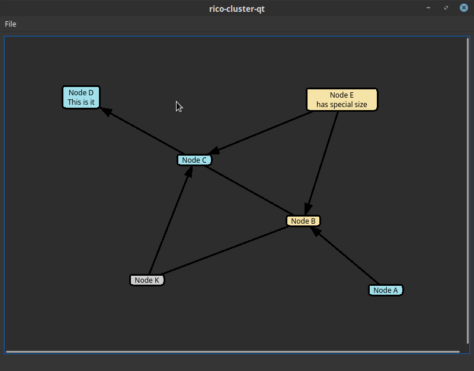
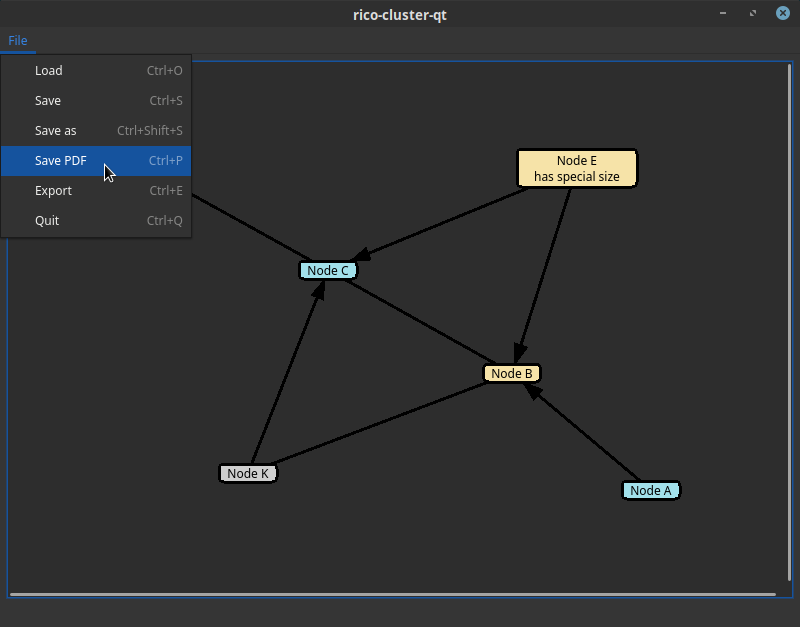

# rico-cluster-qt


rico-cluster-qt is a QT based applications that allows simple and fast creation of rico clusters [1,2]. It uses a simple (example: [rico-cluster-qt-save.json](resources/rico-cluster-qt-save.json) ) JSON representation to store documents. It also generates small efficient PDF output (example: [rico-cluster-qt-print.pdf](resources/rico-cluster-qt-print.pdf) ) you can easily use to print, present and postprocess.

[1] https://de.wikipedia.org/wiki/Cluster_(Kreatives_Schreiben)
[2] https://www.lifehack.org/articles/featured/rico-clusters-an-alternative-to-mind-mapping.html
## Screenshots




## Installation

### Installation on Mac OS X

Open the released DMG file for Mac OS X and simple copy the included Application in your "Applications" folder.

### Installation on Windows

Unzip the relased 7z file using an unpacker. If you do not have one, please go to [z-zip.org](https://www.7-zip.org/) and download and install it on your Windows. If you get any error with regard to a missing MSVCP140.dll please also install the vcredist_x64.exe which is already in the folder. This is taken from [here](https://support.microsoft.com/en-us/help/2977003/the-latest-supported-visual-c-downloads).

### Installation from source via distribution packages for QT

Clone this repo or download the source code file for a release

On Fedora 31 & 32

```bash
sudo yum install qt5-devel cmake
cd rico-cluster-qt
mkdir build
cd build
cmake ..
make
./rico-cluster-qt
```

On Ubuntu 20.04.1 LTS

```bash
sudo apt-get install build-essential cmake qtbase5-dev
cd rico-cluster-qt
mkdir build
cd build
cmake ..
make
./rico-cluster-qt
```

### Installation from source via QT Creator

Either compile it using the QT open source license or download one of the releases.

In QT Creator:
Project > Open Project > Import the CMakeLists.txt > Build

## Usage

After starting the application use the following input commands:

### Edit
* double-click on empty space: create a new node
  * node label dialog supports multiple lines and fast entry (Ctrl-Enter/Return) or (COMMAND-Return) for "Ok"
* double-click on a node: update node label (old text is default for new label)
* single-click on a node: selects node
* (Windows & Linux) "ctrl"+mouse left click on a node or edge: toggles selection on node or edge
* (Mac) "cmd"+mouse left click on a node or edge: toggles selection on node or edge
* "e"-key + two selected nodes: nodes are connected by an edge 
* "delete"/"backspace"-key: deletes edge/node under current selection
* select and drag for nodes is supported (extendable by selection)
* "a"-key while an edge is selected: adds an arrow, repeated pressing of "a" cycles through:
    * edge from node A to B
	* edge from node B to A
	* edge without any direction arrows
* "0" "1" ... "5"-key with node(s) selected: nodes are assigned into autocolored categories (0 - is default category)

### View/Zoom
* "space" + mouse drag: pan on whiteboard
* "ctrl" + "+"/"-"-keys zooms in/out on graph
* "ctrl" + mouse scroll wheel zooms in/out on graph
* drawing area (canvas) is extending, when objects are moved towards the edge

## Export as dot

rico-cluster-qt supports export to the dot format used by [graphviz](https://graphviz.org/).

The graph shown in Screenshots looks like this rendered using dot:


please see [resources/render_with_graphviz.sh](resources/render_with_graphviz.sh) for details.

## Contributing
Pull requests are welcome. For major changes, please open an issue first to discuss what you would like to change.

## Project info

* next features [here](NEXT_FEATURES.md)
* changelog [here](CHANGELOG.md)

## License
[BSD-3-Clause](https://opensource.org/licenses/BSD-3-Clause)
2020-2021 Steffen Weise

## Notice

This project uses the following tools/libraries:

* Qt Open Source Edition [QT5.15](https://qt.io) please also see: [license details QT](https://doc.qt.io/qt-5/licenses-used-in-qt.html)
* Microsoft Visual Studio 2019 [MSVS2019](https://visualstudio.microsoft.com/)
* Apple Xcode [Xcode](https://developer.apple.com/xcode/)
* Fedora 31 [Fed31](https://getfedora.org)
